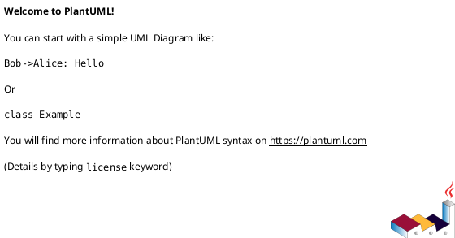

# 📚 Chương 3: Phân Tích & Thiết Kế - Hệ Thống So Sánh Giá Điện Thoại

## 🎯 Tính Năng & Nội Dung

Chương 3 bao gồm:
- ✅ **Yêu cầu chức năng**: 10 use cases chi tiết
- ✅ **Yêu cầu phi chức năng**: Hiệu năng, bảo mật, khả dụng, v.v.
- ✅ **Kiến trúc hệ thống**: Phân tầng (Presentation, Application, Data)
- ✅ **Thiết kế CSDL**: MongoDB 7 collections
- ✅ **Mô hình AI**: PhoBERT + LSTM
- ✅ **Sơ đồ tuần tự**: Chi tiết 4 quy trình chính
- ✅ **9 sơ đồ UML**: Context, Use Case, Architecture, ER, 4 Sequence diagrams

---

## 📁 Danh Sách Files Đã Tạo

```
ecommerce-price-comparison/
├── 📄 Chuong3_PhanTichThietKe.docx        ← File Word chính (Nội dung chương 3)
├── 📄 diagrams_uml.md                      ← Sơ đồ UML dạng text/ASCII
├── 📄 HUONG_DAN_DIAGRAMS.md                ← Hướng dẫn chi tiết
├── 📄 README_CHAPTER3.md                   ← File này
├── 🐍 convert_diagrams.py                  ← Script chuyển PlantUML → PNG
├── 🐍 add_diagrams_to_word.py              ← Script thêm hình vào Word
│
└── 📁 diagrams/                            ← Folder chứa sơ đồ UML
    ├── context.puml                        ← Sơ đồ ngữ cảnh
    ├── usecase.puml                        ← Sơ đồ use case
    ├── architecture.puml                   ← Sơ đồ kiến trúc
    ├── sequence_search.puml                ← Tuần tự: Tìm kiếm
    ├── sequence_crawl.puml                 ← Tuần tự: Crawl dữ liệu
    ├── sequence_sentiment.puml             ← Tuần tự: Phân tích sentiment
    ├── sequence_forecast.puml              ← Tuần tự: Dự báo giá
    ├── entity_relationship.puml            ← Sơ đồ ER
    └── 📁 images/                          ← (Sẽ tạo tự động) PNG/SVG files
```

---

## 🚀 Hướng Dẫn Sử Dụng Từng Bước

### ⏱️ Cách Nhanh Nhất (5 phút)

**Option 1: Chỉ cần nội dung Word**
```bash
# File Word đã sẵn sàng:
Chuong3_PhanTichThietKe.docx
# → Mở file này trong Microsoft Word là xong!
```

**Option 2: Thêm hình vào Word (Thủ công)**
1. Xem sơ đồ trong `diagrams_uml.md` hoặc `HUONG_DAN_DIAGRAMS.md`
2. Vào https://www.plantuml.com/plantuml/uml/
3. Copy nội dung từ file `.puml` tương ứng
4. Paste vào trang PlantUML
5. Click Export → Download PNG
6. Thêm vào Word bằng Insert → Picture

---

### ⏰ Cách Đầy Đủ (20 phút)

#### Bước 1: Chuyển đổi PlantUML Thành PNG

**Cách A: Sử dụng Script Python (Khuyến khích)**
```bash
# Cài đặt dependencies
pip install python-docx

# Chạy script
python convert_diagrams.py

# ✅ Sẽ tạo folder: diagrams/images/ với 8 file PNG
```

**Cách B: Sử dụng PlantUML Online (Thủ công)**
1. Truy cập: https://www.plantuml.com/plantuml/uml/
2. Cho mỗi file `.puml`:
   - Mở file → Copy nội dung
   - Paste vào trang web
   - Click Export → PNG
   - Lưu với tên tương ứng vào folder `diagrams/images/`

**Cách C: Cài đặt PlantUML Local (Tùy chọn)**
```bash
# Windows (Chocolatey)
choco install plantuml

# macOS (Homebrew)
brew install plantuml

# Linux (apt)
sudo apt-get install plantuml

# Sau đó chạy
python convert_diagrams.py
```

---

#### Bước 2: Thêm Hình Vào File Word

**Cách A: Script Tự Động (Khuyến khích)**
```bash
# Sau khi tạo xong images
python add_diagrams_to_word.py

# ✅ Tạo file mới: Chuong3_PhanTichThietKe_VoiHinh.docx
```

**Cách B: Thêm Thủ Công (Trong Word)**
1. Mở file: `Chuong3_PhanTichThietKe.docx`
2. Tìm các dòng: `[Hình 3-X: ...]`
3. Right-click → Insert Picture
4. Chọn từ folder: `diagrams/images/`
5. Chỉnh kích thước nếu cần
6. Lưu file

---

## 📊 Nội Dung Chi Tiết

### 📋 Phần 3.1: Yêu Cầu Chức Năng
- **Danh sách Actor** (4 loại):
  - Người dùng (Customer)
  - Hệ thống crawl
  - Hệ thống AI
  - Nền tảng TMĐT

- **10 Use Cases**:
  - UC1-7: Cho End User (tìm kiếm, xem PQS, lịch sử giá, v.v.)
  - UC8-10: Cho hệ thống (crawl, sentiment, forecast)

### 📋 Phần 3.2: Yêu Cầu Phi Chức Năng
- ⚡ **Hiệu năng**: < 2s search, < 5s LSTM, < 3s PhoBERT/comment
- 🔒 **Bảo mật**: Firebase auth, JWT tokens, mã hóa dữ liệu
- 📱 **Tương thích**: Responsive web, Chrome/Firefox/Safari
- 🛡️ **Khả dụng**: 24/7, < 1% downtime
- 🎯 **Độ chính xác**: Sentiment ≥80%, LSTM MAPE < 5%

### 📋 Phần 3.3: Mô Hình Hệ Thống

**Kiến Trúc Phân Tầng:**
```
┌─────────────────────────────┐
│   Presentation Layer        │  React.js Web + Flutter Mobile
├─────────────────────────────┤
│   Application Layer         │  FastAPI + Crawler + AI Services
├─────────────────────────────┤
│   Data Layer                │  MongoDB + Model Storage
└─────────────────────────────┘
```

**MongoDB Collections:**
- `products` - Thông tin sản phẩm
- `price_history` - Lịch sử giá theo thời gian
- `comments` - Bình luận gốc
- `sentiment_analysis` - Kết quả phân tích sentiment
- `forecast_results` - Kết quả dự báo LSTM
- `product_quality_score` - Điểm chất lượng tổng hợp
- `recommendations` - Khuyến nghị mua

**Mô Hình AI:**
- 🧠 **PhoBERT**: Phân loại sentiment 3 nhãn + aspect detection
- 🧠 **LSTM**: Dự báo giá 5-7 ngày, tính MAE/RMSE/MAPE

### 📋 Phần 3.4: Mô Hình Chi Tiết & Sơ Đồ Tuần Tự

4 Quy trình chính được mô tả chi tiết:

1. **Tìm Kiếm Sản Phẩm** (User → Frontend → Backend → MongoDB)
   - Parse search query
   - Query products
   - Join price_history, sentiment, forecast
   - Return comprehensive JSON

2. **Crawl Dữ Liệu** (Scheduler → Crawler → 3 Websites → MongoDB)
   - Playwright control browser
   - BeautifulSoup parse HTML
   - Normalize & upsert data
   - Trigger AI analysis

3. **Phân Tích Cảm Xúc** (MongoDB → PhoBERT → MongoDB)
   - Preprocess text
   - Tokenization & embedding
   - Classification (positive/negative/neutral)
   - Aspect extraction & RQS calculation

4. **Dự Báo Giá** (MongoDB → LSTM → MongoDB)
   - Data cleaning & normalization
   - Sequence preparation
   - LSTM prediction
   - Calculate metrics & direction

---

## 🎨 Danh Sách 9 Sơ Đồ

| # | Tên Sơ Đồ | File | Mô Tả |
|---|-----------|------|-------|
| 3-1 | Context Diagram | `context.puml` | Tương tác User, System, 3 sàn TMĐT, Database |
| 3-2 | Use Case Diagram | `usecase.puml` | 10 use cases chính |
| 3-3 | Architecture Diagram | `architecture.puml` | Kiến trúc 3 tầng chi tiết |
| 3-4 | ER Diagram (MongoDB) | `entity_relationship.puml` | 7 collections & mối quan hệ |
| 3-6 | Sequence: Search | `sequence_search.puml` | User search → results |
| 3-7 | Sequence: Crawl | `sequence_crawl.puml` | Scheduler → Crawl → MongoDB |
| 3-8 | Sequence: Sentiment | `sequence_sentiment.puml` | Comments → PhoBERT → Scores |
| 3-9 | Sequence: Forecast | `sequence_forecast.puml` | Price history → LSTM → Forecast |

---

## 🛠️ Yêu Cầu & Cài Đặt

### Yêu Cầu Cơ Bản
- Python 3.8+
- Microsoft Word (hoặc LibreOffice)

### Yêu Cầu Để Chuyển Đổi Diagrams

**Option 1: Sử dụng PlantUML Online (Không cần cài)**
- Truy cập: https://www.plantuml.com/plantuml/uml/
- Copy-paste-export (Miễn phí, không cần cài đặt)

**Option 2: Sử dụng Script Python**
```bash
pip install python-docx
python convert_diagrams.py
```

**Option 3: Cài PlantUML Local**
```bash
# Windows
choco install plantuml

# macOS
brew install plantuml

# Linux
sudo apt-get install plantuml

# Sau đó
python convert_diagrams.py
```

---

## 📝 Cách Chỉnh Sửa Nội Dung

### Sửa Nội Dung Word
1. Mở `Chuong3_PhanTichThietKe.docx` trong Word
2. Sửa text như bình thường
3. Lưu lại

### Sửa Sơ Đồ UML
1. Mở file `.puml` bằng text editor
2. Sửa theo cú pháp PlantUML
3. Re-export thành PNG (sử dụng PlantUML Online hoặc script)

### Cấu Trúc PlantUML Cơ Bản


Tham khảo: https://plantuml.com/guide

---

## 💡 Mẹo & Lưu Ý

### Khi Sử Dụng PlantUML Online
- URL encode content nếu có ký tự đặc biệt
- Export SVG cho chất lượng cao hơn PNG
- Nếu diagram quá lớn, chia thành nhiều diagram nhỏ

### Khi Thêm Hình Vào Word
- Resize hình để fit trang (width ≈ 5.5 inches)
- Thêm caption và page reference
- Kiểm tra tỷ lệ khung hình không bị méo

### Nếu Gặp Lỗi

**PlantUML Online không load:**
- Kiểm tra kết nối internet
- Thử browser khác

**Convert_diagrams.py báo lỗi:**
- Cài PlantUML: `pip install plantuml`
- Hoặc sử dụng PlantUML Online

**Word không mở được:**
- Kiểm tra file .docx không bị hỏng
- Thử mở bằng LibreOffice nếu cần

---

## 📞 Hỗ Trợ & Tham Khảo

### Tài Liệu Tham Khảo
- PlantUML Guide: https://plantuml.com/guide
- Python-docx Docs: https://python-docx.readthedocs.io/
- UML Diagrams: https://www.lucidchart.com/pages/uml-diagram/

### Files Liên Quan
- `Chuong3_PhanTichThietKe.docx` - Nội dung chính
- `diagrams_uml.md` - Sơ đồ dạng text
- `HUONG_DAN_DIAGRAMS.md` - Hướng dẫn chi tiết
- `convert_diagrams.py` - Script chuyển đổi
- `add_diagrams_to_word.py` - Script thêm hình

---

## ✅ Checklist Trước Khi Nộp

- [ ] Mở file Word, kiểm tra toàn bộ nội dung
- [ ] Kiểm tra các hình vẽ (9 diagrams)
- [ ] Kiểm tra format: font size, spacing, trang bị
- [ ] Kiểm tra tham chiếu hình (Hình 3-1 đến Hình 3-9)
- [ ] Lưu file final dạng .docx
- [ ] Backup toàn bộ folder diagrams (nếu cần)

---

## 🎉 Tóm Tắt

| Bước | Hành động | Thời gian |
|------|----------|----------|
| 1 | Xem nội dung Word | 5 phút |
| 2 | Chuyển PlantUML → PNG | 5-10 phút |
| 3 | Thêm hình vào Word | 5 phút |
| 4 | Review & lưu | 5 phút |
| **Total** | | **20 phút** |

**File Output:**
- ✅ `Chuong3_PhanTichThietKe.docx` - Nội dung
- ✅ `Chuong3_PhanTichThietKe_VoiHinh.docx` - Kèm hình (nếu tạo)
- ✅ `diagrams/images/*.png` - Các diagram riêng lẻ

---

**Tạo lúc:** 2026-08-13  
**Version:** 1.0  
**Status:** ✅ Ready for submission

🎓 Chúc bạn thành công với báo cáo DATN!

